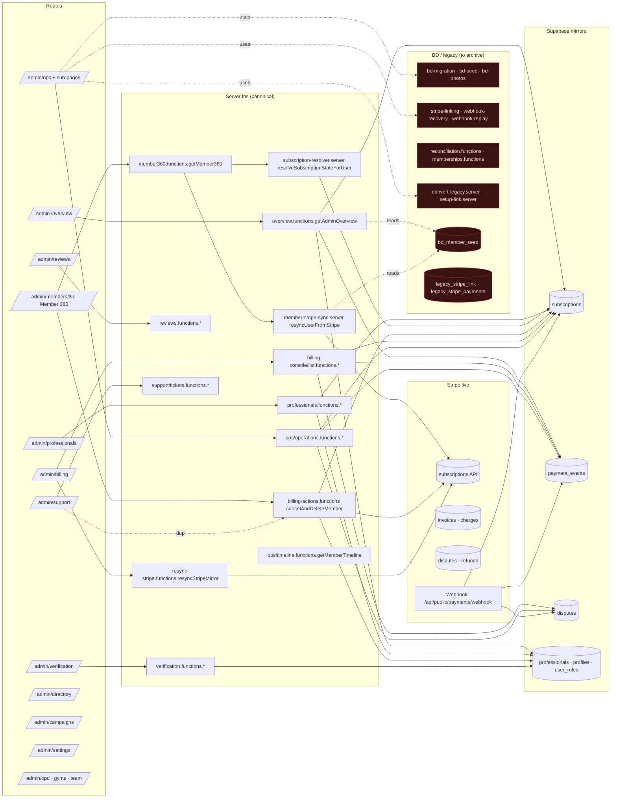

# Admin Route → Server Fn → Data Dependency Graph

_Auto-generated 2026-06-29 as part of the Phase 1 read-only audit._

## Key

- **Solid arrow** — active read/write today.
- **Dotted arrow** — read-only safety-net (kept for now) or duplicate path.
- **Red boxes** — Brilliant/BD/legacy modules to archive in Phase 7.

## Hot spots

1. `S3 (getMember360)` and `S5 (resyncUserFromStripe)` both dip into `bd_member_seed` to discover Stripe customer ids. That read is acceptable safety-net behaviour and can stay until Phase 7 confirms every active subscription is reachable from `subscriptions.stripe_customer_id` alone.
2. `A5 (/admin/ops/billing)` is the heaviest concentration of legacy cards: `BdRailSwapCard`, `BdSetupLinkCard`, `PriceIdBackfillCard`. They are read-or-trigger-only — none of them are required for steady-state operations.
3. `A8 → S7` (support `MemberCancelCard` calling `cancelAndDeleteMember`) duplicates `A3 → S7`. Phase 6 collapses both into a single Member 360 Danger Zone path.
4. `S9` (ops billing health) overlaps with `S6` (billing console KPIs). The console is the canonical surface; the ops health tiles should be folded into the console or a slimmed Operations hub.
